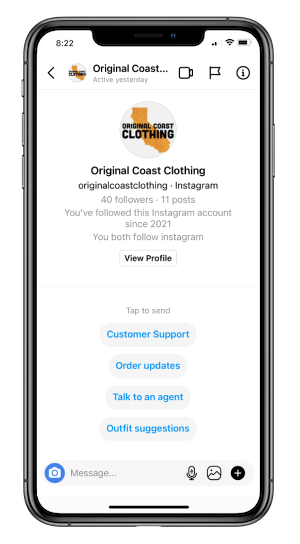

# Original Coast Clothing Instagram Experience

Original Coast Clothing (OC) is a fictional clothing brand created to showcase key features of the Instagram API. OC leverages key features to deliver a great customer experience. Using this demo as inspiration, you can create a delightful messaging experience that leverages both automation and live customer support. We are also providing the open source code of the app and a guide to deploy the experience on your local environment or remote server.

Try it now by messaging [@originalcoastclothing](https://www.instagram.com/originalcoastclothing) or [commenting on a post](https://www.instagram.com/p/CNaLh5xgppt).



See the [Developer Documentation on this experience](https://developers.facebook.com/docs/messenger-platform/instagram).

# Setting up your App

## Requirements

- An **[Instagram Business Account](https://help.instagram.com/502981923235522?fbclid=IwAR0o0WpsSiJKF9D8iDm9NYeUJXD2_qoiOqzg6fcPXp1kHPBYpqpi1Q8Tzbw)**
- A **Facebook Page** [connected to that account](https://developers.facebook.com/docs/instagram-api/overview#pages)
- A **Facebook Developer Account** that can perform [Tasks](https://developers.facebook.com/docs/instagram-api/overview#tasks) on that Page
- A **[Facebook App](https://developers.facebook.com/docs/development/create-an-app)** with Basic settings configured

## Setup Steps

1. Configure your Instagram integration by following the [Getting Started](https://developers.facebook.com/docs/messenger-platform/instagram/get-started) documentation.
2. Add some [testing Instagram accounts](https://developers.facebook.com/docs/messenger-platform/instagram/features/webhook#webhook-testing) that you'll use to test the experience.

At this point you should have the following

- App ID
- App Secret
- Page ID
- Page Access Token
- Instagram Account connected to your Page
- Instagram Account(s) registered as test accounts

# Installation

You will need:

- [Node](https://nodejs.org/en/) 10.x or higher
- A server for your code. Options include:
  - Remote server service such as [Heroku](https://www.heroku.com/) or [Glitch](http://glitch.com/)
  - Local tunneling service such as [ngrok](https://ngrok.com/)
  - Your own webserver


# Usage

## Using Click Deploy

You can automatically deploy this project to Heroku or Glitch with these buttons.

[](https://bit.ly/2QQE5Qo) &nbsp; [](https://bit.ly/3wB07G1)

Once your server is configured and running, proceed to configuring your webhooks

## Using ngrok

#### 1. Install tunneling service

If not already installed, install ngrok via [download](https://ngrok.com/download) or via command line:

```bash
npm install -g ngrok
```

In the directory of this repo, request a tunnel to your local server with your preferred port
```bash
ngrok http 3000
```

The screen should show the ngrok status:

```
Session Status                online
Account                       Redacted (Plan: Free)
Version                       2.3.35
Region                        United States (us)
Web Interface                 http://127.0.0.1:4040
Forwarding                    http://1c3b838deacb.ngrok.io -> http://localhost:3000
Forwarding                    https://1c3b838deacb.ngrok.io -> http://localhost:3000

Connections                   ttl     opn     rt1     rt5     p50     p90
                              0       0       0.00    0.00    0.00    0.00
```
Note the https URL of the external server that is fowarded to your local machine. In the above example, it is `https://1c3b838deacb.ngrok.io`.

#### 2. Install the dependencies

Open a new terminal tab, also in the repo directiory.

```bash
$ npm install
```

Alternatively, you can use [Yarn](https://yarnpkg.com/en/):

```bash
$ yarn install
```

#### 3. Set up .env file

Copy the file `.sample.env` to `.env`

```bash
cp .sample.env .env
```

Edit the `.env` file to add all the values for your app and page.

#### 4. Run your app locally

```bash
node app.js
```

You should now be able to access the application in your browser at [http://localhost:3000](http://localhost:3000)

Confirm that you can also access it at the external URL from step 1, then proceed to configuring your webhooks.

## Using Heroku

#### 1. Install the Heroku CLI

Download and install the [Heroku CLI](https://devcenter.heroku.com/articles/heroku-cli)

#### 2. Create an app from the CLI

```bash
heroku apps:create
# Creating app... done, ⬢ mystic-wind-83
# Created http://mystic-wind-83.herokuapp.com/ | git@heroku.com:mystic-wind-83.git
```

Note the name given to your app. In this example, it was `mystic-wind-83`.

#### 3. Set your environment variables

On the [Heroku App Dashboard](https://dashboard.heroku.com/), find your app and set up the config vars following the comments in the file ```.sample.env```

Alternatively, you can set env variables from the command line like this:

 ```bash
heroku config:set PAGE_ID=XXXX
```

#### 4. Deploy the code

```bash
git push heroku main
```

#### 5. View log output

```bash
heroku logs --tail
```

If you can reach your server at the url from Step 2, proceed to configuring your webhooks.

## Configure your webhooks

Now that your server is running, your webhook endpoint is at the path `/webhook`. In the Heroku example above, this would be `http://mystic-wind-83.herokuapp.com/webhook`.

Set up your webhooks by following the [Instagram Webhook documentation](https://developers.facebook.com/docs/messenger-platform/instagram/features/webhook) and subscribe to the [`messages`](https://developers.facebook.com/docs/graph-api/webhooks/reference/instagram/#messages), [`messaging_postbacks`](https://developers.facebook.com/docs/graph-api/webhooks/reference/instagram/#messaging_postbacks), and [`comments`](https://developers.facebook.com/docs/graph-api/webhooks/reference/instagram/#comments) webhooks.

## Test that your app setup is successful

Log in to Instagram as one of the test accounts you added above. Try sending a message to the Instagram account connected to your Page.

You should see the webhook called in the ngrok terminal tab, and in your application terminal tab.

If you see a response to your message in messenger, you have fully set up your app! Voilà!


## License

Sample Instagram App Original Coast Clothing is BSD licensed, as found in the LICENSE file.

See the [CONTRIBUTING](CONTRIBUTING.md) file for how to help out.
